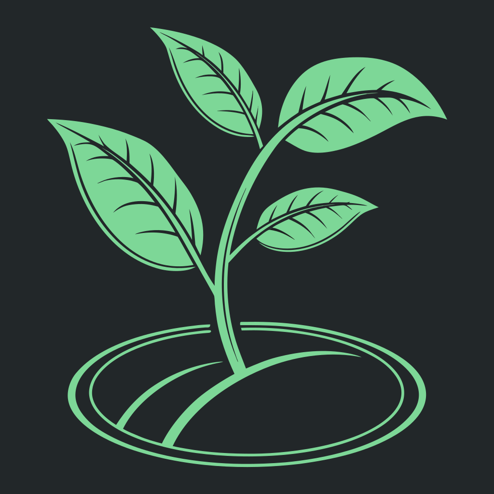

# PlantRun

<p align="center">
  
</p>

<p align="center">
  <a href="https://github.com/hacs/integration"></a>
  
</p>

Track every grow run — sensors, notes, photos, timelapse.

PlantRun is a Home Assistant custom integration project for documenting cultivation runs with structured metrics, cultivar context, and run history.

---

## ✨ Features (current)

- Run lifecycle tracking (`start`, `phase`, `end`)
- Notes and event history per run
- SeedFinder-based cultivar lookup (with local fallback)
- Attach cultivar profiles to runs
- Mid-run sensor/camera binding updates
- Live sensors for active run + active cultivar status
- Persistent storage via Home Assistant storage helper

---

## 📦 Installation

### Option A — HACS (recommended)

1. Open **HACS** in Home Assistant.
2. Go to **⋮ → Custom repositories**.
3. Add repository URL:
   - `https://github.com/NicoM701/PlantRun`
4. Category/type: **Integration**.
5. Install **PlantRun**.
6. Restart Home Assistant.
7. Go to **Settings → Devices & Services → Add Integration**.
8. Search for **PlantRun** and complete setup.

### Option B — Manual installation

1. Copy `custom_components/plantrun` into your HA config folder:
   - `<config>/custom_components/plantrun`
2. Restart Home Assistant.
3. Add integration via **Settings → Devices & Services**.

---

## 🚀 Quick start

1. Start a run via service:
   - `plantrun.start_run` with `run_name`
2. (Optional) Lookup cultivar:
   - `plantrun.search_cultivar` with `species` (+ optional `breeder`)
3. Attach cultivar to run:
   - `plantrun.attach_cultivar_to_run` with `run_id`, `cultivar_id`
4. Bind sensors/camera (any time during run):
   - `plantrun.bind_sensor_to_run`
5. Update phase and notes as needed:
   - `plantrun.set_phase`
   - `plantrun.add_note`
6. End run:
   - `plantrun.end_run`

---

## 🧩 Services

- `plantrun.start_run`
- `plantrun.end_run`
- `plantrun.set_phase`
- `plantrun.add_note`
- `plantrun.search_cultivar`
- `plantrun.attach_cultivar_to_run`
- `plantrun.refresh_cultivar`
- `plantrun.bind_sensor_to_run`
- `plantrun.unbind_sensor_from_run`

See `custom_components/plantrun/services.yaml` for fields.

---

## 📊 Exposed sensors

- `sensor.plantrun_active_run`
- `sensor.plantrun_active_phase`
- `sensor.plantrun_active_cultivar_name`
- `sensor.plantrun_active_cultivar_breeder`
- `sensor.plantrun_active_cultivar_flower_window`
- `sensor.plantrun_total_runs`
- `sensor.plantrun_last_event`

---

## 🗂️ Project structure

```text
custom_components/plantrun/
  __init__.py
  config_flow.py
  const.py
  manager.py
  manifest.json
  providers_seedfinder.py
  sensor.py
  services.yaml
  storage.py
  strings.json
dashboard/
  plantrun-dashboard.yaml
hacs.json
```

---

## 🛣️ Roadmap

- Recorder-based run summary generation (time-window by run)
- Optional backup snapshots for long-term retention
- Improved Config Flow for sensor binding UX
- Photo events + camera snapshot hooks
- Timelapse pipeline for completed runs

---

## 🧪 Stability note

PlantRun is in active MVP iteration. SeedFinder lookup currently uses best-effort web parsing and may require adjustments if upstream page structure changes.

## License

TBD
